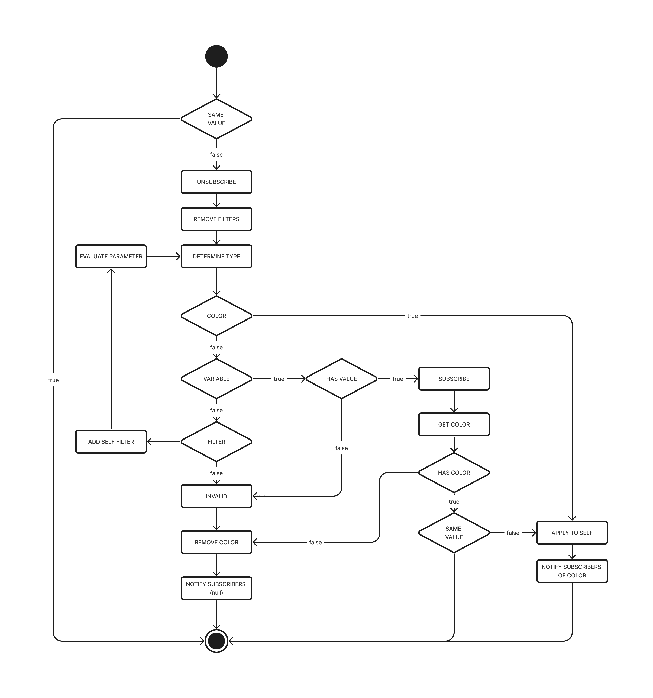

# Bootstrap Better
I despise bootstrap. I far prefer writing my own styles and creating my own design system. Bue that as it may, I need to use bootstrap for work, specifically bootstrap 3.4 themes. We use https://getbootstrap.com/docs/3.4/customize/ to create and modify bootstrap configs, which is painful because it does not show you a preview of the colors you have selected.

This is a bookmarklet intended to ease some of that pain by modifying the https://getbootstrap.com/docs/3.4/customize/ website. Each input containing a color will change it's background to that color. This works for inputs containing variables, as well as functions like lighten and darken. The backgrounds will update as you change them.

## Reactivity Overview
Being a bookmarklet I did not have access to front end frameworks to make reactivity easy, so I had to write by own mini reactivity framework.

